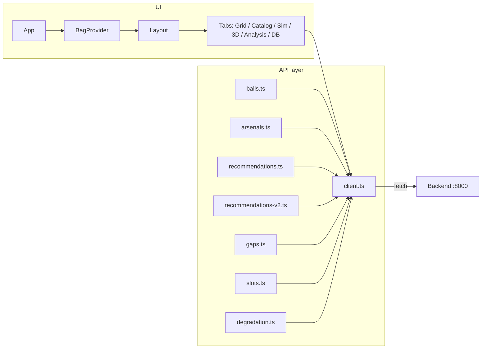

# Frontend

React + TypeScript SPA built with Vite. Bowling Bowl Grid UI: catalog browse, virtual bag (arsenal), RG–Differential Voronoi grid, recommendations (v1 compact + v2 method toggle), 6-ball slot assignment, gap analysis components, 2D and 3D simulation, video-based pose analysis with optional handoff to simulation, and degradation tooling. Data comes from the FastAPI backend; see [Backend](backend.md) for endpoints.

## Configuration

**Environment:** The frontend reads `VITE_API_BASE` at build time. In development, the Vite dev server proxies `/api` to the backend, so you typically do not set it.

| Variable      | Required | Description                                                                 |
| ------------- | -------- | --------------------------------------------------------------------------- |
| VITE_API_BASE | no       | Base URL for API requests. Default: `/api`. Set to e.g. `http://localhost:8000` if not using the proxy. |

**Code:** `services/frontend/src/api/client.ts` uses `import.meta.env.VITE_API_BASE`; `apiUrl(path)` builds the full URL. Dev proxy is in `services/frontend/vite.config.ts`: `/api` → `http://localhost:8000` (rewrite strips `/api` so the backend sees paths like `/balls`).

## Project structure

High-level layout under `services/frontend/`:

- **Entry:** `index.html` → `src/main.tsx` mounts the app into `#root`.
- **Root component:** `src/App.tsx` wraps the tree in `BagProvider` and renders `Layout`.
- **Layout:** `src/components/Layout.tsx` — header, **tab navigation** (no client-side router; `useState` for the active tab). Default tab is **Grid View**. On the grid, a **right-hand panel** toggles between compact recommendations and slot assignment (`Recs` / `Slots` buttons).
- **Main views (by tab):** `GridView`, `BallCatalog`, `SimulationView`, `SimulationView3D`, `AnalysisView`, `BallDatabaseView`. Full-width `RecommendationsPanel` and `GapsPanel` are still rendered when internal tab state is `recommendations` or `gaps`, but **the header does not expose buttons** for those values today; primary UX for recs/slots is the grid + right panel.
- **Components (representative):** `ArsenalPanel`, `RecommendationsListCompact`, `SlotAssignmentPanel`, `RecommendationsPanel`, `GapsPanel`, `BallCard`, `VirtualBag`, `BallComparisonTable`, `DegradationCompareView`, analysis subcomponents under `src/components/analysis/`, etc.
- **State:** `src/context/BagContext.tsx` — arsenal (bag) entries with optional game count, saved arsenal id, and mutators (`addToBag`, `removeFromBag`, `setGameCount`, `setBag`, `setSavedArsenalId`). Use `useBag()`.
- **API layer:** `src/api/` — `client.ts` (get, post, patch, del, `ApiError`, `apiUrl`); `balls.ts`, `arsenals.ts`, `recommendations.ts`, `recommendations-v2.ts`, `gaps.ts`, `slots.ts`, `degradation.ts`.
- **Physics / vision utilities:** `src/utils/parametric-physics.ts`, `phase-detector.ts`, `bowling-kinematics.ts`, `decision-framework.ts`, `calibration.ts`; `src/physics/bowling-physics.ts`; workers `src/workers/physics-worker.ts`, `src/workers/vision-worker.ts` (MediaPipe PoseLandmarker path for uploaded video).
- **Types:** `src/types/ball.ts`, `src/types/simulation.ts`, `src/types/analysis.ts` — align with backend payloads where applicable.
- **Tests:** `src/test/setup.ts` (MSW, jest-dom, mocks); `server.ts`, `handlers.ts`, `fixtures.ts`. Colocated tests: `**/*.test.{ts,tsx}`. Playwright E2E: `tests/e2e/` (see [E2E_TEST_PLAN](E2E_TEST_PLAN.md)).

## Architecture and data flow

Single tree: `App` → `BagProvider` → `Layout`. Each view uses `useBag()` and/or API modules as needed. The API layer uses `fetch` via `client.ts`; failures become `ApiError`. The backend is the source of truth for balls, arsenals, recommendations, gaps, v2 recs, slots, degradation compare, and oil patterns; the bag persists through the arsenals CRUD API when the user saves.

## Main tabs (header)

| Tab            | Purpose |
| -------------- | ------- |
| **Grid View**  | Voronoi RG–diff map (`GridView`), arsenal column, right panel: **Recs** (`RecommendationsListCompact`, v2 method / degradation controls) or **Slots** (`SlotAssignmentPanel`). |
| **Catalog**    | Browse/search balls and add to bag (`BallCatalog`). |
| **Simulation** | 2D parametric lane + trajectory (`SimulationView`). Accepts optional initial params from Analysis via `simInitialParams`. |
| **3D Sim**     | Three.js lane + Rapier worker (`SimulationView3D`, `physics-worker.ts`). |
| **Analysis**   | Uploaded video, pose pipeline, kinematics, baselines (`AnalysisView`); can send delivery params to the Simulation tab. |
| **Ball Database** | Table-oriented catalog (`BallDatabaseView`). |

## Testing

- **Unit / component:** Vitest. Config: `services/frontend/vitest.config.ts` (jsdom, React plugin, `src/test/setup.ts`, `@` → `src`).
- **Commands:** `npm run test` (watch), `npm run test:run` (CI-style single run).
- **E2E:** `npm run test:e2e` / `npm run test:e2e:ui` — Playwright, see [E2E_TEST_PLAN](E2E_TEST_PLAN.md).

## Build and run

Clone-and-run steps: root [README](../README.md).

- **Develop:** `cd services/frontend && npm install && npm run dev` → `http://localhost:5173`. Backend on port 8000 so `/api` proxy works.
- **Build:** `npm run build` — `tsc -b` and Vite; output `dist/`.
- **Preview:** `npm run preview`.

Production (Docker nginx + `/api` proxy): [Deploy](deploy.md).
