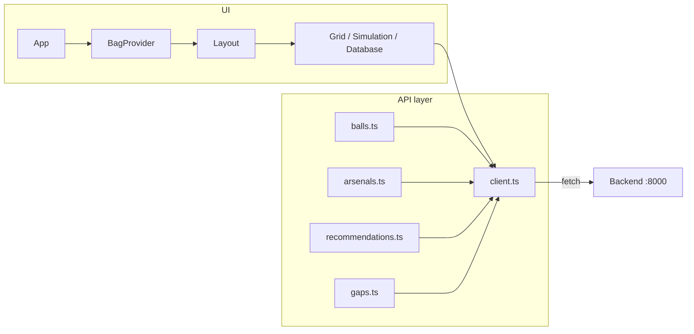

# Frontend

React + TypeScript SPA built with Vite. It is the Bowling Bowl Grid UI: users browse the ball catalog, build an arsenal (virtual bag), view an RG–Differential coverage map (Voronoi), get recommendations and gap analysis, and run wear/degradation simulation. All data comes from the backend API; see [Backend](backend.md) for endpoints.

## Configuration

**Environment:** The frontend reads `VITE_API_BASE` at build time. In development, the Vite dev server proxies `/api` to the backend, so you typically do not set it.

| Variable        | Required | Description                                                                 |
| --------------- | -------- | --------------------------------------------------------------------------- |
| VITE_API_BASE   | no       | Base URL for API requests. Default: `/api`. Set to e.g. `http://localhost:8000` if not using the proxy. |

**Code:** `services/frontend/src/api/client.ts` uses `import.meta.env.VITE_API_BASE`; `apiUrl(path)` builds the full URL. Dev proxy is in `services/frontend/vite.config.ts`: `/api` → `http://localhost:8000` (rewrite strips `/api` so backend sees paths like `/balls`).

## Project structure

High-level layout under `services/frontend/`:

- **Entry:** `index.html` → `src/main.tsx` mounts the app into `#root`.
- **Root component:** `src/App.tsx` wraps the tree in `BagProvider` and renders `Layout`.
- **Layout:** `src/components/Layout.tsx` — header, tab navigation (Grid View, Simulation, Ball Database), and the active view. No router; tab state is local `useState`.
- **Components:** `src/components/` — `Layout`, `GridView`, `ArsenalPanel`, `RecommendationsListCompact`, `BallDatabaseView`, `SimulationView`, `BallCatalog`, `BallCard`, `VirtualBag`, `GapsPanel`, `RecommendationsPanel`, `BallComparisonTable`, etc.
- **State:** `src/context/BagContext.tsx` — bag (arsenal) state: list of balls with optional game count, saved arsenal ID, and methods: `addToBag`, `removeFromBag`, `setGameCount`, `setBag`, `setSavedArsenalId`. Consumed via `useBag()`.
- **API layer:** `src/api/` — `client.ts` (get, post, patch, del, ApiError, apiUrl); `balls.ts`, `arsenals.ts`, `recommendations.ts`, `gaps.ts` call the client and return typed responses.
- **Types:** `src/types/ball.ts` — mirrors backend models: Ball, BallsResponse, ArsenalBallInput, ArsenalResponse, ArsenalSummary, RecommendationItem, RecommendResponse, GapItem, GapZone, GapResponse.
- **Tests:** `src/test/setup.ts` (MSW server, jest-dom, ResizeObserver mock); `server.ts`, `handlers.ts`, `fixtures.ts`. Test files live next to source: `**/*.test.{ts,tsx}`.

## Architecture and data flow

The app is a single tree: `App` → `BagProvider` → `Layout`. Layout switches views by tab; each view is a component that may use `useBag()` and the API modules. The API layer uses `apiUrl()` and `fetch`; network errors and non-OK responses are turned into `ApiError`. The backend is the source of truth for balls, arsenals, recommendations, and gaps; the frontend does not persist the bag except by calling the arsenals CRUD API.

## Main views

- **Grid View (default):** RG–Differential coverage map (Voronoi diagram via d3-delaunay), colored by slot (heavy oil, med-heavy, benchmark, med-light, spare). Side panels: current arsenal (add/remove balls, game counts) and a compact recommendations list (K-NN ranked). Uses `GridView`, `ArsenalPanel`, `RecommendationsListCompact`.
- **Simulation:** Wear/degradation simulation over the current bag; uses backend degradation logic. Implemented in `SimulationView`.
- **Ball Database:** Catalog browse/search; list and detail of balls from the backend. Implemented in `BallDatabaseView`.

Other views (Recommendations full panel, Gaps panel, Ball Catalog) are in the codebase and can be wired to tabs if needed; Layout currently exposes Grid, Simulation, and Ball Database.

## Testing

- **Runner:** Vitest. Config: `services/frontend/vitest.config.ts` (jsdom, React plugin, `src/test/setup.ts`, `@` → `src`).
- **Setup:** `src/test/setup.ts` — MSW server listen/reset/close; `@testing-library/jest-dom`; ResizeObserver mock for components that measure layout.
- **Commands:** From `services/frontend/`: `npm run test` (watch), `npm run test:run` (single run).
- **Location:** Tests live beside source: `src/**/*.test.{ts,tsx}` and `src/**/*.spec.{ts,tsx}`. API and context tests use MSW handlers in `src/test/`.

## Build and run

For clone-and-run steps (install, start Postgres, backend, frontend), see the root [README](../README.md).

- **Develop:** From repo root, `cd services/frontend && npm install && npm run dev`. Dev server runs at `http://localhost:5173`. The backend must be running (e.g. `uvicorn app.main:app --reload` in `services/backend`) so `/api` requests succeed.
- **Build:** `npm run build` — TypeScript compile and Vite build; output in `dist/`.
- **Preview:** `npm run preview` — serve `dist/` locally to verify production build.

Production deployment (Docker, nginx serving the built SPA and proxying `/api` to the backend): see [Deploy](deploy.md).
